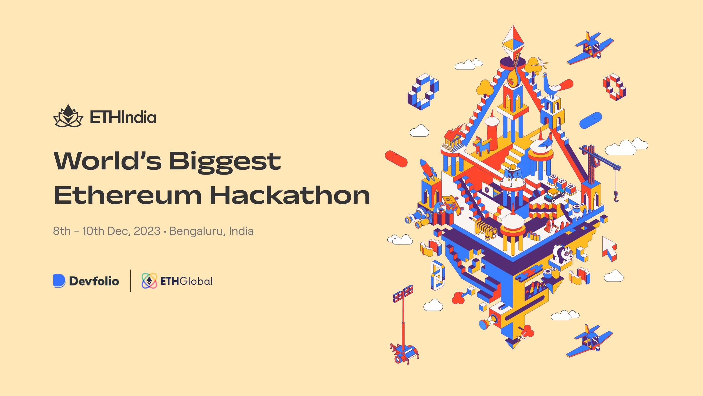

# Servify by SigmaNerds
Built with ☕ and ❤️ at [ETHIndia 2023](https://ethindia.co/).

## 📝 Table of Contents
 - [Goals](https://github.com/karanpargal/sigmanerds?tab=readme-ov-file#-goals)
 - [Knowledge Primer](https://github.com/karanpargal/sigmanerds?tab=readme-ov-file#-knowledge-primer)
 - [What Problems Servify Solves](https://github.com/karanpargal/sigmanerds?tab=readme-ov-file#-what-problems-servify-solves)
 - [Preview](https://github.com/karanpargal/sigmanerds?tab=readme-ov-file#-preview)
 - [Technology Stack](https://github.com/karanpargal/sigmanerds?tab=readme-ov-file#-technology-stack)
 - [Architecture](https://github.com/karanpargal/sigmanerds?tab=readme-ov-file#-architecture)
 - [Emphasis on Tracks](https://github.com/karanpargal/sigmanerds?tab=readme-ov-file#-emphasis-on-tracks)
 - [Challenges](https://github.com/karanpargal/sigmanerds?tab=readme-ov-file#-challenges)
 - [What's Next](https://github.com/karanpargal/sigmanerds?tab=readme-ov-file#%EF%B8%8F-whats-next)
 - [Contributions](https://github.com/karanpargal/sigmanerds?tab=readme-ov-file#-contributions)
 - [License](https://github.com/karanpargal/sigmanerds?tab=readme-ov-file#-license)

## 💡 Goals

Accessing dependable and trustworthy local services can be difficult in today's fast-paced environment. People often face difficulties in finding trustworthy providers for tasks such as gardening, carpentry, and tutoring within their communities. This lack of a centralized, secure platform contributes to uncertainties surrounding service quality, reliability, and safety.

To address this issue, we present you **Servify**, a platform designed to connect individuals seeking local services with qualified providers on blockchain, for unparalleled credibility, accountability and authenticity.

## 🧠 Knowledge Primer

 - **Anon Aadhaar** is a zero-knowledge protocol that allows Aadhaar ID owners to prove their identity in a privacy preserving way. It provides a set of tools to generate and verify proofs, authenticate users and verify proofs on-chain.
 - **Scroll** is a Layer 2 blockchain platform that aims to scale Ethereum by processing transactions off-chain and then committing them to the main Ethereum chain. It utilizes zero-knowledge proofs (ZKPs) to verify the validity of these off-chain transactions without revealing the underlying data, ensuring scalability, privacy, and security.
 - **Push Protocol** Push Protocol, formerly known as EPNS, is a Web3 communication protocol that enables cross-chain notifications and messaging for dApps, wallets, and services. It provides a decentralized and gasless way for users to receive real-time updates and interact with Web3 applications.

## 🚩 What Problems Servify Solves
 - **Lack of a Centralized Hub:** The absence of a centralized platform for local services with verified credibility creates difficulties for individuals looking to connect with reliable service providers within their communities.
 - **Trust and Security Concerns:** Current methods for verifying service providers often fall short in establishing trust and security, leading to reservations among users about the reliability of the services offered.
 - **Need for Anonymity and Verification:** Anon Aadhaar will serve as a solution to balance the need for user anonymity with the requirement for identity verification, offering a secure and privacy-centric approach to establishing trust.
 - **Community-Based Exchanges:** The proposed platform aims to facilitate secure and reliable exchanges within the community, fostering a sense of safety and accountability among users.

Servify addresses these challenges by leveraging Anon Aadhaar verification to create a transparent, and secure environment for local service exchanges.

## 📺 Preview

## 💻 Technology Stack

| Blockchain ⛓️ | Backend 🛠️ | Frontend ✨ |
| :---: | :---: | :---: |
| Solidity | Node | React |
| Scroll | Express | TypeScript |
| Base | TypeScript | Formik |
|   |   | Yep |
|   |   | Framer Motion |

## 📐 Architecture

## 👔 Emphasis on Tracks

### Ethereum Foundation: Anon Aadhar
 - **Usage**: Anon Aadhar is being utilised as proof of citizenship and identity in Servify, to maintain anonimity while provisioning credibility.
 - **Implementation**: Anon Aadhaar utilizes ZK-SNARKs, a type of zero-knowledge proof, to enable users to prove their identity without disclosing their actual Aadhaar number or any other personal details. This ensures that sensitive information remains completely confidential. Users can generate anonymized proofs using their Aadhaar card and a mobile application or web interface. These proofs contain cryptographic data that can be used to verify the user's identity without revealing any underlying information.Organizations or individuals can verify the validity of an Anon Aadhaar proof using a verifier app or service. The verifier app interacts with the blockchain to confirm the proof's authenticity and ensure the user's identity is valid.

### Push Protocol
 - **Usage**: Push Protocol is a decentralized notification protocol built on Ethereum blockchain.
 - **Implementation**: Servify is using **Support Chat** to offer real-time chat support to the users directly, eliminating the need for users to switch to external platforms, creating a seamless and convenient experience. **P2P Chat** facilitates secure and decentralized peer-to-peer communication between users without the need for centralized servers and intermediaries, ensuring privacy and data ownership. Servify uses **Token Gated Chat** restricting access to specific groups of users based on their token ownership. This enables the creation of exclusive communities for high-value users, fostering deeper engagement and loyalty. **Push Notification** enables Servify to send real-time notifications to users' wallets or mobile devices, keeping them informed about important events, updates, and reminders.

### Scroll
 - **Usage**:
 - **Implementation**: Sepolia Testnet Explorer on https://sepolia.scrollscan.com/
   - SBT on Scroll: `0x189D6807030b09D86CA4c61c8bfE22DDcA4A682E` [Link](https://sepolia.scrollscan.com/address/0x189D6807030b09D86CA4c61c8bfE22DDcA4A682E)
   - Escrow on Scroll: `0x25Bb7EB5AbcE2B2245Ac2E5dDD3988765f624FE5` [Link](https://sepolia.scrollscan.com/address/0x25bb7eb5abce2b2245ac2e5ddd3988765f624fe5)

## 😭 Challenges

## ⏭️ What's Next

## 🤝 Contributions
Meet the creators of Servify:

We are not open to receiving contributions to this project at this moment. If you'd like to highlight any bugs or pass on recommendations, you can always open an issue and give us a heads up! 

## 📜 License

We have opted for the [CC BY-NC 4.0 DEED](https://creativecommons.org/licenses/by-nc/4.0/) license, which means that -

**You are free to:**

 - **Share** — copy and redistribute the material in any medium or format
 - **Adapt** — remix, transform, and build upon the material
The licensor cannot revoke these freedoms as long as you follow the license terms.

**Under the following terms:**

 - **Attribution** — You must give appropriate credit , provide a link to the license, and indicate if changes were made . You may do so in any reasonable manner, but not in any way that suggests the licensor endorses you or your use.
 - **NonCommercial** — You may not use the material for commercial purposes .
No additional restrictions — You may not apply legal terms or technological measures that legally restrict others from doing anything the license permits.
