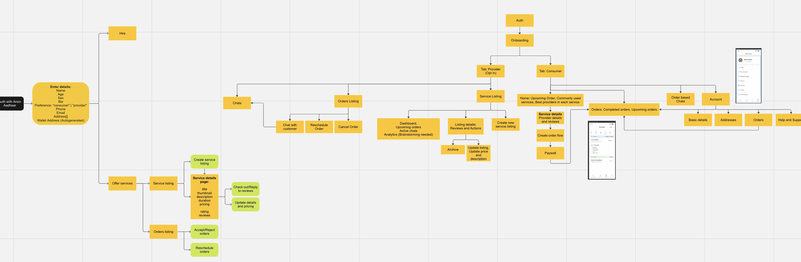

# Servify by SigmaNerds
Built with ☕ and ❤️ at [ETHIndia 2023](https://ethindia.co/).

## 📝 Table of Contents
 - [Goals](https://github.com/karanpargal/sigmanerds?tab=readme-ov-file#-goals)
 - [Knowledge Primer](https://github.com/karanpargal/sigmanerds?tab=readme-ov-file#-knowledge-primer)
 - [What Problems Servify Solves](https://github.com/karanpargal/sigmanerds?tab=readme-ov-file#-what-problems-servify-solves)
 - [Preview](https://github.com/karanpargal/sigmanerds?tab=readme-ov-file#-preview)
 - [Technology Stack](https://github.com/karanpargal/sigmanerds?tab=readme-ov-file#-technology-stack)
 - [Architecture](https://github.com/karanpargal/sigmanerds?tab=readme-ov-file#-architecture)
 - [Emphasis on Tracks](https://github.com/karanpargal/sigmanerds?tab=readme-ov-file#-emphasis-on-tracks)
 - [Challenges](https://github.com/karanpargal/sigmanerds?tab=readme-ov-file#-challenges)
 - [What's Next](https://github.com/karanpargal/sigmanerds?tab=readme-ov-file#%EF%B8%8F-whats-next)
 - [Contributions](https://github.com/karanpargal/sigmanerds?tab=readme-ov-file#-contributions)
 - [License](https://github.com/karanpargal/sigmanerds?tab=readme-ov-file#-license)

## 💡 Goals

Accessing dependable and trustworthy local services can be difficult in today's fast-paced environment. People often face difficulties in finding trustworthy providers for tasks such as gardening, carpentry, and tutoring within their communities. This lack of a centralized, secure platform contributes to uncertainties surrounding service quality, reliability, and safety.

To address this issue, we present you **Servify**, a platform designed to connect individuals seeking local services with qualified providers on blockchain, for unparalleled credibility, accountability and authenticity.

## 🧠 Knowledge Primer

 - **Anon Aadhaar** is a zero-knowledge protocol that allows Aadhaar ID owners to prove their identity in a privacy preserving way. It provides a set of tools to generate and verify proofs, authenticate users and verify proofs on-chain.
 - **Scroll** is a Layer 2 blockchain platform that aims to scale Ethereum by processing transactions off-chain and then committing them to the main Ethereum chain. It utilizes zero-knowledge proofs (ZKPs) to verify the validity of these off-chain transactions without revealing the underlying data, ensuring scalability, privacy, and security.
 - **Push Protocol** Push Protocol, formerly known as EPNS, is a Web3 communication protocol that enables cross-chain notifications and messaging for dApps, wallets, and services. It provides a decentralized and gasless way for users to receive real-time updates and interact with Web3 applications.


## 🚩 What Problems Servify Solves
 - **Lack of a Centralized Hub:** The absence of a centralized platform for local services with verified credibility creates difficulties for individuals looking to connect with reliable service providers within their communities.
 - **Trust and Security Concerns:** Current methods for verifying service providers often fall short in establishing trust and security, leading to reservations among users about the reliability of the services offered.
 - **Need for Anonymity and Verification:** Anon Aadhaar will serve as a solution to balance the need for user anonymity with the requirement for identity verification, offering a secure and privacy-centric approach to establishing trust.
 - **Community-Based Exchanges:** The proposed platform aims to facilitate secure and reliable exchanges within the community, fostering a sense of safety and accountability among users.

Servify addresses these challenges by leveraging Anon Aadhaar verification to create a transparent, and secure environment for local service exchanges.

## 📺 Preview

## 💻 Technology Stack

| Blockchain ⛓️ | Backend 🛠️ | Frontend ✨ | Protocols |
| :---: | :---: | :---: | :---: |
| Solidity | Node | React | Anon Aadhar |
| Scroll | Express | TypeScript | Push Protocol |
| Base | TypeScript | Formik |   |
|   |   | Yep |   |
|   |   | Framer Motion |   |

## 📐 Architecture

`Note: Click on the image to see the full architecture clearly.`

## 👔 Emphasis on Tracks

### Ethereum Foundation: Anon Aadhar
 - **Usage**: Anon Aadhar is being utilised as proof of citizenship and identity in Servify, to maintain anonimity while provisioning credibility.
 - **Implementation**:

**React context provider Anon Aadhaar**

```
ReactDOM.createRoot(document.getElementById('root')!).render(
  <React.StrictMode>
    <WagmiConfig config={wagmiConfig}>
      <RainbowKitProvider chains={chains}>
        <AnonAadhaarProvider _appId={ANON_AADHAAR_APP_ID}>
          <App />
        </AnonAadhaarProvider>
      </RainbowKitProvider>
    </WagmiConfig>
  </React.StrictMode>,
);
```
**Consuming Anon Aadhar Validation into our Custom Forms**
``` 
const [anonAadhaar] = useAnonAadhaar();
  useEffect(() => {
    if (anonAadhaar.status === 'logged-in') {
      formik.setFieldValue('anonAadhaarLoggedIn', true);
    }
  }, [anonAadhaar]);
```
```
<div className="mb-6">
        <Label>Verify your identity with Anon Aadhaar</Label>
        <LogInWithAnonAadhaar />
        ...
```

### Push Protocol
 - **Usage**:
   - **Support Chat**: Used for offering real-time chat support to the users directly, eliminating the need for users to switch to external platforms, creating a seamless and convenient experience.
   - **P2P Chat:** To facilitate secure and decentralized peer-to-peer communication between users without the need for centralized servers and intermediaries, ensuring privacy and data ownership.
   - **Token Gated Chat:** Used for restricting access to specific groups of users based on their token ownership. This enables the creation of exclusive communities for high-value users, fostering deeper engagement and loyalty.
   - **Push Notification:** This enables Servify to send real-time notifications to users' wallets or mobile devices, keeping them informed about important events, updates, and reminders.
 - **Implementation**: Code with the implementation of Push Protocol is housed in `server/notifications/notifications.service.ts`. [Link](https://github.com/karanpargal/sigmanerds/blob/main/server/notifications/notifications.service.ts)


### Scroll
 - **Usage**: Contracts pertaining to Servify are deployed on Scroll.
 - **Implementation**: Sepolia Testnet Explorer on https://sepolia.scrollscan.com/
   - SBT on Scroll: `0x189D6807030b09D86CA4c61c8bfE22DDcA4A682E` [Link](https://sepolia.scrollscan.com/address/0x189D6807030b09D86CA4c61c8bfE22DDcA4A682E)
   - Escrow on Scroll: `0x25Bb7EB5AbcE2B2245Ac2E5dDD3988765f624FE5` [Link](https://sepolia.scrollscan.com/address/0x25bb7eb5abce2b2245ac2e5ddd3988765f624fe5)


## 💪 Challenges Faced (and WAGMI!)
- **Developer Experience of SDKs**: Inadequate or unclear documentation did significantly hinder our developer experience as implementation was difficult in the given duration with limited support.
- **Figuring out the Settlement Flow**: Another challenge we encountered was optimizing the settlement flow, especially in cases where users were dissatisfied with the service provided. Balancing flexibility for both users and providers presented a nuanced trade-off. 
  - Ultimately, we resolved this by implementing a support chat feature. This solution aimed to address user concerns efficiently, allowing for real-time communication and issue resolution. 
  - The introduction of the support chat provided a streamlined approach to handle disputes or dissatisfaction, promoting a user-centric and responsive system for dispute resolution within the service.

## ⏭️ What's Next
- **Enable direct off-ramping of cryptocurrency**: Enabling direct off-ramping of cryptocurrency can be simplified through the integration of the Saber SDK by Mudrex. This SDK streamlines the process, allowing for a seamless conversion of crypto assets into traditional fiat currencies. With Mudrex's Saber SDK, users can efficiently and directly withdraw their crypto holdings, providing a user-friendly and convenient off-ramping solution. The SDK's features facilitate a straightforward experience, ensuring that users can easily convert and access the value of their cryptocurrencies in traditional financial systems. This integration enhances accessibility and usability, contributing to a more versatile and user-centric crypto off-ramping experience.

- **Enable easier on-boarding with the help of OKTO Wallet**: Okto Wallet or any similar wallet service can enhance the onboarding experience for users, making it efficient, secure, and user-friendly.

## 🤝 Contributions
Meet the creators of Servify:

<a href="https://github.com/karanpargal/sigmanerds/graphs/contributors">

</a>

We are not open to receiving contributions to this project at this moment. If you'd like to highlight any bugs or pass on recommendations, you can always open an issue and give us a heads up! 

## 📜 License

We have opted for the [CC BY-NC 4.0 DEED](https://creativecommons.org/licenses/by-nc/4.0/) license, which means that -

**You are free to:**

 - **Share** — copy and redistribute the material in any medium or format
 - **Adapt** — remix, transform, and build upon the material
The licensor cannot revoke these freedoms as long as you follow the license terms.

**Under the following terms:**

 - **Attribution** — You must give appropriate credit , provide a link to the license, and indicate if changes were made . You may do so in any reasonable manner, but not in any way that suggests the licensor endorses you or your use.
 - **NonCommercial** — You may not use the material for commercial purposes .
No additional restrictions — You may not apply legal terms or technological measures that legally restrict others from doing anything the license permits.
